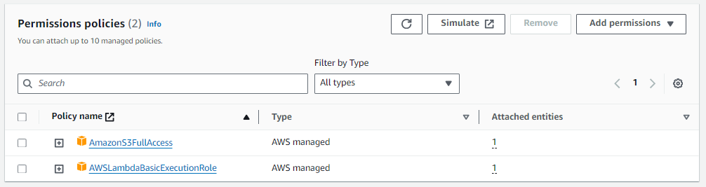

# Lambda-and-Boto3-to-retrieve-data-from-S3-Buckets
This uses a Lambda Python run environment to retrieve a geopackage from another accounts S3 bucket, and copy the data into your own S3 bucket. 

## Goal of this Script
The purpose of this script is to scrape the NBS 'noaa-ocs-nationalbathymetry-pds' bucket, and retrieve the latest Area Of Interest Geopackage. This geopackage has all the NBS Tile AOIs where the NBS is currently available. This is useful for Electronic Nautical Chart production, as it will show if the NBS is available for a partiucular area, hence available for ENC production/application in that area. In my other repo "Using-Boto-to-retrieve-data-from-Public-AWS-Bucket", this script exists for running on your local device, to save the geopackage locally to your PC. The script has been revised to run in AWS via a Lambda Function. The function then saves the geopackage to your S3 bucket on AWS. 

## Major Actions in AWS 
- Create bucket for geopackage to be uploaded to. (geopackagebuck)
   
  
   

- Create IAM Role for Lambda Function to assume (Assign AWSLambdaAccess and S3Access Permissions). (lambdadownload)
  

  
  
- Generate Lambda Function (Assign IAM role for execution role). (GPKGDownload)
  

  
  
-  Add your Boto script to function and deploy.
  

- Update Function Handler to match your function entry point.
  

- Update Function Timeout and Ephemeral storage. (Function needs to run long enough to download data from source bucket, and upload to destination. Ephemeral storage needs to meet required size of geopackage)
  

- Run test to ensure the Lambda Function works. 
  

 

- Check Bucket Prefix to ensure geopackage data is there. 

## Tips for making your script Lambda ready
- You may need multiple Boto client sessions. In this instance two were used. The first is an anonymous Boto Client to download the data from the source bucket. The second is an S3 Boto Client session. This must be used and will pull the credentials from the Lambda enviornment to give S3 Access. 

- Make sure to create and properly name the Bucket and Key destination for your data.

